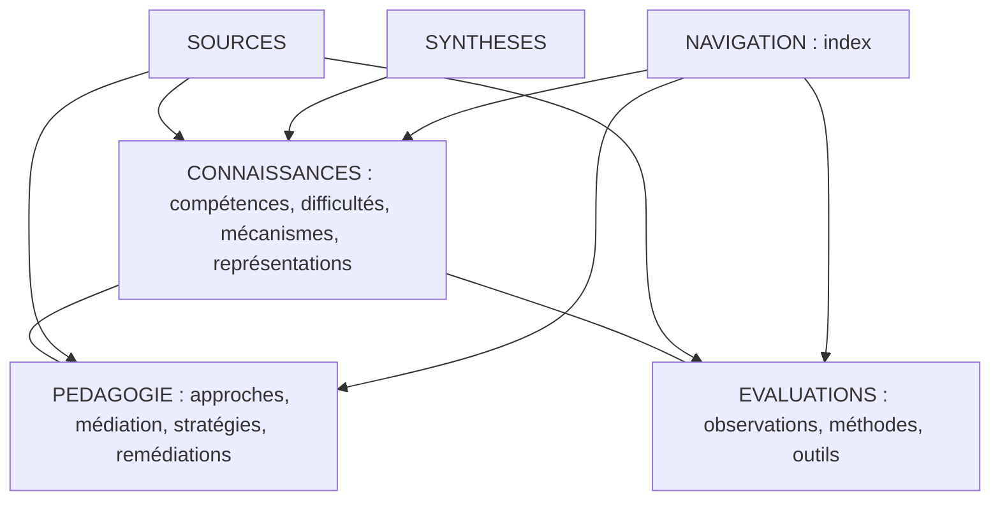

# Architecture documentaire — hybride D (réconciliation historique du 2026-10-08)

## Décision

Une seule fiche canonique par objet. Les index sont des liens et les relations sont qualifiées ; aucun doublon par niveau, discipline ou public.

La séparation des familles **CONNAISSANCES / PÉDAGOGIE / ÉVALUATIONS** reprend la version révisée retrouvée dans les échanges historiques. La catégorie **médiation** est explicitement conservée à la demande de l'utilisateur, mais sa frontière détaillée reste à confirmer.

## Familles principales

- [CONNAISSANCES](../CONNAISSANCES/README.md) : compétences, difficultés, mécanismes, représentations, stratégies de résolution, résultats scientifiques.
- [PEDAGOGIE](../PEDAGOGIE/README.md) : approches, médiation, stratégies d'enseignement, interventions et remédiations, feedback et consolidation.
- [EVALUATIONS](../EVALUATIONS/README.md) : observation, méthodes, outils et passations.
- [SOURCES](../SOURCES/README.md) : études, recommandations et pistes de terrain.
- [RESSOURCES](../RESSOURCES/README.md) : notices de supports et accès officiels ; pas de duplication des outils tiers.
- [SYNTHESES](../SYNTHESES/README.md) : synthèses transversales originales.
- [NAVIGATION](../NAVIGATION/README.md) : index multi-entrées.
- [DOCUMENTATION](README.md) : conventions publiques.
- [recherches/RR-001](../recherches/RR-001/FICHES-CANDIDATES.md) : archives provisoires, non base canonique parallèle.

## Frontières importantes

- **Représentation** : forme concrète, visuelle, langagière ou symbolique d'un concept ; pas automatiquement une intervention.
- **Stratégie cognitive** : procédure utilisée par l'apprenant ; **stratégie pédagogique** : choix d'enseignement ou de guidage.
- **Approche** : cadre d'enseignement ; **remédiation** : intervention ciblée, avec conditions et résultats à vérifier.
- **Médiation** : catégorie historique rappelée, définition à valider avant y ranger des fiches.
- **Évaluation** : tâche, méthode et qualité de mesure ; **ressource** : support ou outil externe, référencé sans reproduction.

## Règles de conservation

Identifiant stable, source et passage probant, population et transférabilité, statut documentaire distinct du verdict scientifique et de la porte de publication, historique daté des corrections. Les dossiers historiques déplacés conceptuellement restent comme redirections, sans suppression. Les documents RR-001 restent provisoires jusqu'à audit.

## Historique

- 2026-10-08 : premier déploiement ayant mélangé approches, interventions et évaluations dans CONNAISSANCES.
- 2026-10-08 : correction après comparaison avec l'architecture historique ; restauration de PEDAGOGIE et EVALUATIONS, préservation des chemins existants.
