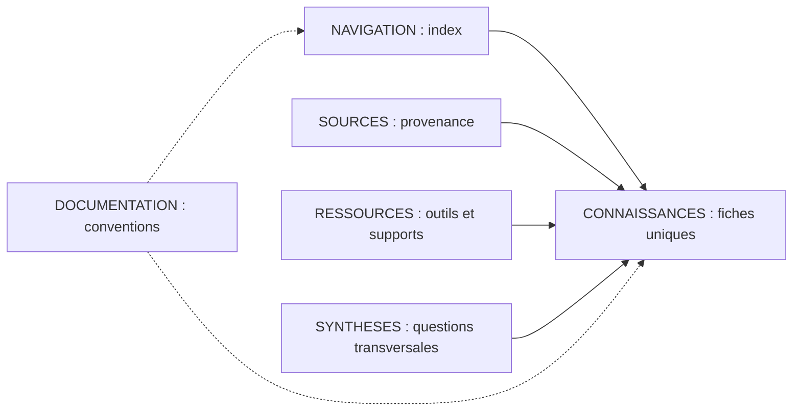

# Architecture documentaire — hybride D

## Principe

**Une fiche canonique par objet**, classée par nature dans `CONNAISSANCES/`. Des liens typés connectent les fiches aux `SOURCES/`, `RESSOURCES/` et `SYNTHESES/`. `NAVIGATION/` offre des index multi-entrées, sans recopier les fiches. `DOCUMENTATION/` décrit les conventions publiques.

## Emplacements

- `CONNAISSANCES/{famille}/{ID}-{slug}.md` : objet scientifique canonique.
- `SOURCES/{type}/{ID}-{slug}.md` : notice de source ; passage probant et droits.
- `RESSOURCES/{type}/{ID}-{slug}.md` : notice et lien officiel.
- `SYNTHESES/{ID}-{slug}.md` : synthèse originale reliée aux objets.
- `NAVIGATION/*.md` : index de liens par angle de recherche.
- `recherches/RR-001/` : **archive de consolidation déjà existante**, non seconde base canonique.

## Règles

1. Vérifier l'existant avant `CREATE` ; si objet connu, `ENRICH`, `REFINE`, `CORRECT`, `CHALLENGE`, `LINK` ou `NO_CHANGE`.
2. Garder un identifiant stable et un titre lisible. Un renommage ne doit pas casser les liens.
3. Statut documentaire, verdict de preuve et porte de publication sont **trois dimensions distinctes**.
4. Toute modification scientifique conserve source, date et raison.
5. Pas de dossier ou de fiche vide inventant une connaissance ; les `README` servent de points d'entrée.
6. L'architecture est évolutive : nouvelles familles seulement si les objets réels le justifient.

## Migration RR-001

Les [sept fiches candidates](../recherches/RR-001/FICHES-CANDIDATES.md) sont une archive provisoire ; **elles ne deviennent pas automatiquement sept fiches validées**. Après audit, créer les fiches canoniques correspondantes et relier les index. Conserver l'historique de leur origine.